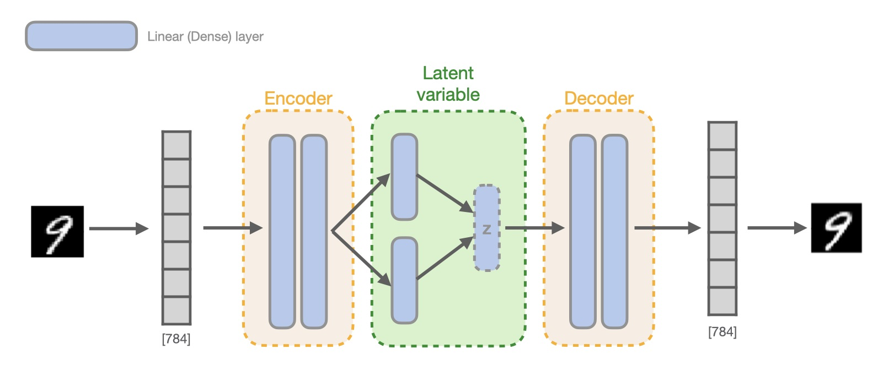
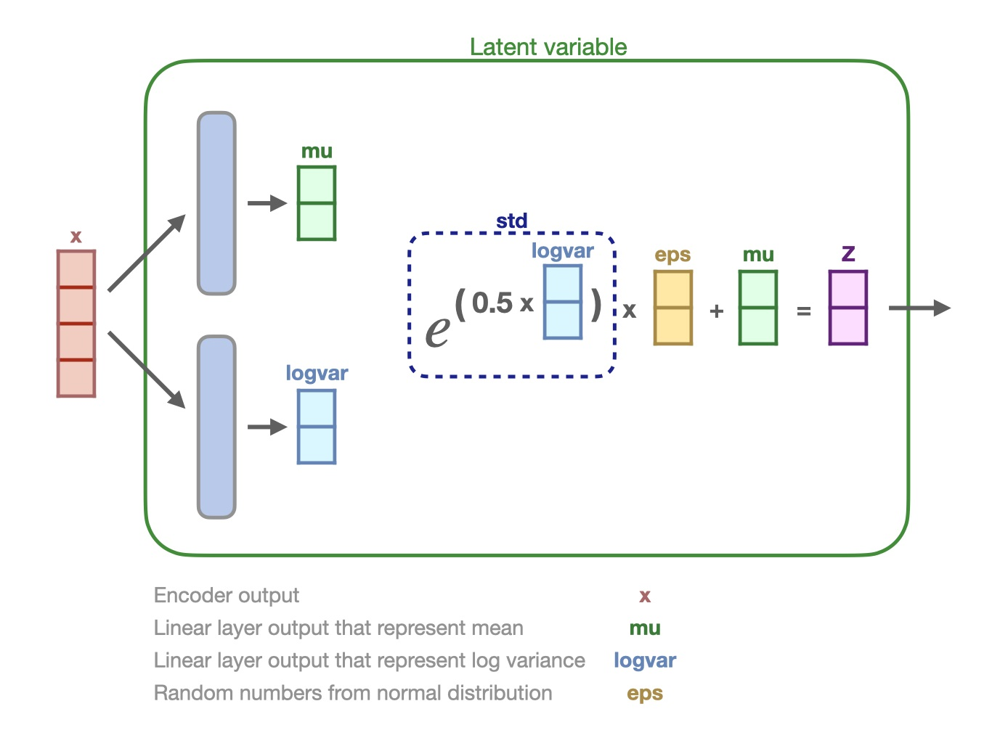
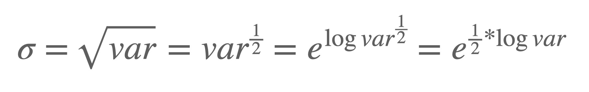

# Variational Autoencoder

This is another PyTorch implementation of Variational Autoencoder (VAE) trained on MNIST dataset. The goal of this exercise is to get more familiar with older generative models such as the family of autoencoders.

### Model

The model consists of usual Encoder-Decoder architecture:



Encoder and Decoder are standard 2-layer Feed-Forward Networks, however, what is exactly happening in the 
middle section with the *latent variable*?



Two linear (dense) layers will represent **mean** and **log-variance**. These layer will use encoders output as input and 
will produce `mu` and `logvar` vectors. From these vectors latent variable `z` is computed as shown in picture above.

1. Compute standard deviation (`std`) from `logvar`
2. Sample from the normal distribution to get `eps` and mutiply it with `std`
3. Add mean (`mu`)

This way of computing `z` in the paper is called **parameterization trick** without which backpropagation wouldn't be possible.

Upper-mentioned formula for deriving `logvar` from standard deviation can be seen below. 
Since standard deviation (sigma) is the square root of the variance the formula can be slightly re-written like:



> I am not sure why log-variance is chosen to represent standard deviation. My assumption is that log has some better
> properties but also fits better with the regularization term since lowering `logvar` to zero, means `std` will be 1. 
> Which means we got normal distribution. (mean=0, std=1)

Code-wise from [model.py](vae/model.py):

```python
class LatentZ(nn.Module):
    def __init__(self, hidden_size, latent_size):
        super().__init__()
        self.mu = nn.Linear(hidden_size, latent_size)
        self.logvar = nn.Linear(hidden_size, latent_size)

    def forward(self, p_x):
        mu = self.mu(p_x)
        logvar = self.logvar(p_x)

        std = torch.exp(0.5*logvar)
        eps = torch.randn_like(std)

        return std * eps + mu, logvar, mu
```

A couple of differences compared to the original paper, *sigmoid* activations are replaced by *relu*. And instead of 
*SGD*, *Adam* optimizer was used.

### Loss

The loss function consists of two terms. Reconstruction loss, for which was used `binary_cross_entropy`, in the paper was used *mean squared error*. And regularization loss or Kullback–Leibler divergence that will force `z` to be a normal distribution with *mean=0* and *std=1*.

```python
def loss_criterion(inputs, targets, logvar, mu):
    # Reconstruction loss
    bce_loss = F.binary_cross_entropy(inputs, targets, reduction="sum")
    # Regularization term
    kl_loss = -0.5 * torch.sum(1 + logvar - mu.pow(2) - logvar.exp())

    return bce_loss + kl_loss
```

If `mu` and `logvar` were singular values, instead of vectors, plotting a regularization term would look something like this:


Keep in mind that graph shows `m` as mean and `l` as logvar. Reducing this loss will push *m* and *l* to be 0. 
And when **logvar=0** then **std = e^(0.5\*logvar) = e^(0.5\*0) = 1**.

### Issues

One interesting thing that happened in my initial attempts is that I would get these kinds of results no matter how long
the training persisted.


When leaving the `reduction` parameter in `binary_cross_entropy` to its default value of `average`-ing loss per batch, the
loss would always stay the same and the all images would become a blob of all number combined. Changing reduction 
parameter to `sum` fixed the issue where model can properly reconstruct images. Examples can be seen in notebooks.

### Notebooks
Example training and samples can be seen in [notebook](notebooks/train_and_eval.ipynb).

Visualization of generated samples as 2-dimensional manifold can be seen in [notebook](notebooks/visualizing_manifold.ipynb)


### Resources
Original paper:
* [Auto-Encoding Variational Bayes](https://arxiv.org/abs/1312.6114)

Helpful GitHub repositories:

* https://github.com/wiseodd/generative-models
* https://github.com/bhpfelix/Variational-Autoencoder-PyTorch

Tutorial:
* https://jaan.io/what-is-variational-autoencoder-vae-tutorial/
